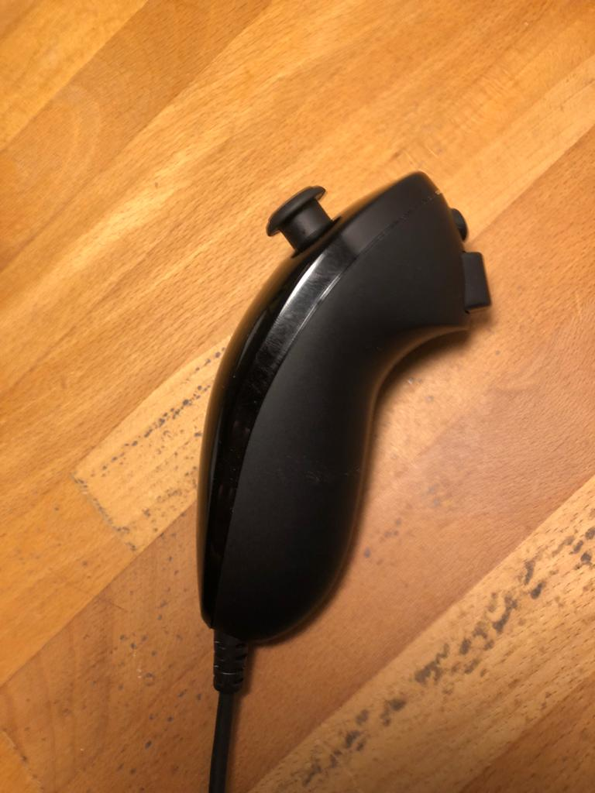
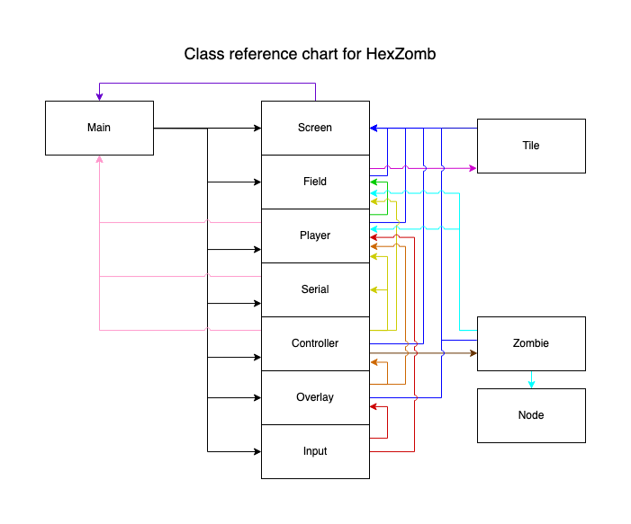

# AIP-final 2022
## Final project for the CreaTe MOD6 course AI Programming.

[Description](#description)\
[Gameplay](#gameplay)\
[Hardware](#hardware)\
[Code Overview](#code-overview)\
[Libraries](#libraries)

### Description
This Zombie survival game is based in a far away, hexagonally shaped world.
The objective of the game is to survive long nights and days until help arrives to save you.
The player is stranded on a island with lush fields, dense forests and big mountains.
There are resources to be mined and fortifications to be built.
But watch out, at night, the undead come out of the ground and try to eat you.

The game is completely written in Python, utilizing the [PyGame library](https://www.pygame.org/).
The player can be controlled via the mouse or by using the external Nunchuck controller 
which integrates a LED clock, [see below](#hardware).

### Gameplay
1. To move your hero around the island, you either use your mouse or the joystick to select adjecent tiles,
then press the left mouse button or the Z-key on the nunchuck to move.
2. If you want to perform an action, select a tile and press the right mouse button or the C-key on the nunchuck.
Depending on the tile, you will either gain resources, build a wall (that becomes very useful against the nightly
invaders) or destroy a wall.
3. During the night, creepy undead beings will spawn from the ground and try to eat you! Avoid their bites by
running away or building barricades to exhaust them.
4. The end...? If you manage to survive on this deserted island long enough, a search party will come to your rescue.
For now though .. good luck!

    
    
    
    
    
    
    

### Hardware
For added fun, the game can be played with an external LED clock and Nintendo Wii Nunchuck. The LED clock displays
the current time of the day as well as your remaining health. The Nunchuck provides an ergonomic and intuitive
gaming interface to play HexZomb. In the images below, the LEDs are blown out, however the day cycle should contain
blue skies and a yellow sun, while the night sky has a faint blue glow with a full white moon.

    
    
    

### Code overview
Below you can find an inheritance diagram which explains the relations between all classes.

    

### Libraries
The terrain is generated by utilizing the [Perlin Noise library](https://pypi.org/project/perlin-noise/).
The communication with the arduino that drives the LED clock and controller is accompliced by using the
[PySerial library](https://pythonhosted.org/pyserial/) and a custom communication protocol. The [Random library](
https://docs.python.org/3/library/random.html) is used for randomisation of spawn and animations. 
[Math](https://docs.python.org/3/library/math.html) helps with some of the tougher calculations by having
loads of standard functions. The [Time library](https://docs.python.org/3/library/time.html) is used for 
keeping track of game time, as well as calculations regarding the flow of animation frames and updating of the screen.
[Numpy](https://numpy.org/doc/stable/) is used for some heavier calculations and functions that the normal math 
library does not include. Lastly, the [Bisect library](https://docs.python.org/3/library/bisect.html) is used 
for some array transformations and sorting.